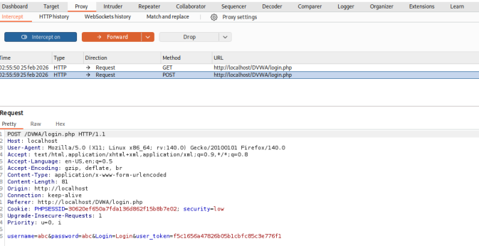
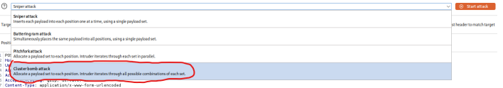
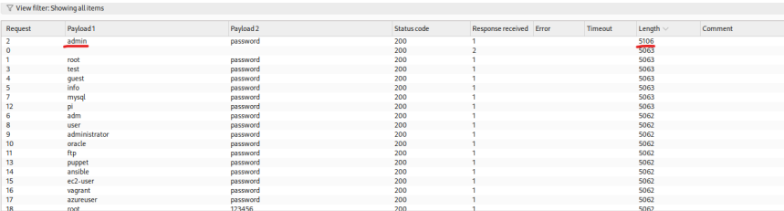

# 01 - Brute Force

## Clasificación

- OWASP: A07 – Identification and Authentication Failures  
- Severidad:  Crítica  
- CVSS: 9.8 (AV:N/AC:L/PR:N/UI:N/S:U/C:H/I:H/A:H)  
- CWE: CWE-307 – Improper Restriction of Excessive Authentication Attempts  

---

## Descripción

La aplicación presenta una vulnerabilidad de tipo **Brute Force** debido a la ausencia de mecanismos de control en el proceso de autenticación.

No existe limitación de intentos de inicio de sesión ni medidas de protección frente a ataques automatizados, lo que permite a un atacante probar múltiples combinaciones de credenciales hasta encontrar una válida.

Este comportamiento facilita la explotación mediante técnicas de fuerza bruta.

---

## Evidencia

Para la explotación de la vulnerabilidad se utilizó **Burp Suite**, junto con **FoxyProxy**, con el objetivo de interceptar y automatizar peticiones HTTP.

### Proceso realizado

1. Intercepción de la petición HTTP del formulario de login mediante Burp Proxy  
2. Envío de la petición al módulo **Intruder**  
3. Configuración del ataque tipo **Cluster Bomb**  
4. Uso de listas de usuarios y contraseñas (SecLists)  
5. Ejecución del ataque automatizado  

Como resultado del ataque, se identificaron credenciales válidas:

- **Usuario:** admin  
- **Contraseña:** password  

Posteriormente, se verificó el acceso exitoso a la aplicación utilizando dichas credenciales.

---

## Evidencias visuales

### Intercepción con burpsuite

 
 ### Configuración Intruder

### Resultado ataque

## Impacto

La explotación de esta vulnerabilidad permite:

- Acceso no autorizado a cuentas
- Compromiso de credenciales
- Escalada de privilegios
- Acceso completo a funcionalidades restringidas

En un entorno real, esto podría derivar en el control total de la aplicación.

## Recomendaciones

Para mitigar esta vulnerabilidad se recomienda implementar:

- Limitación de intentos de autenticación
- Bloqueo temporal de cuentas tras múltiples intentos fallidos.
- Implementación de CAPTCHA
- Uso de autenticación multifactor (MFA)
- Registro y monitorización de intentos sospechosos
- Políticas de contraseñas robustas
## Referencias
- **OWASP Top 10 – A07:** Identification and Authentication Failures
- **CWE-307** – Improper Restriction of Excessive Authentication Attempts
- **CAPEC-49** – Password Brute Forcing