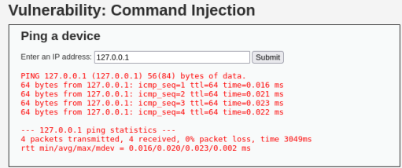
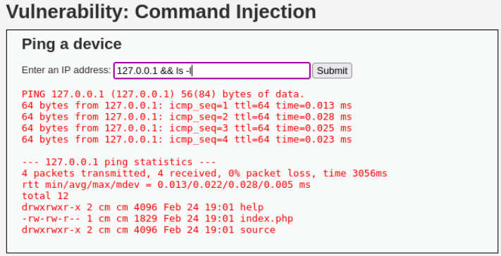
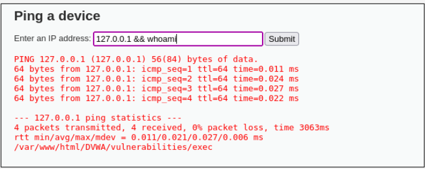

# 02 - Command Injection

## Clasificación

- OWASP: A03 – Injection  
- Severidad: 🔴 Crítica  
- CVSS: 10 (AV:N/AC:L/PR:N/UI:N/S:C/C:H/I:H/A:H)  
- CWE: CWE-77 – Improper Neutralization of Special Elements used in a Command  

---

## Descripción

La aplicación presenta una vulnerabilidad de tipo **Command Injection**, permitiendo la ejecución de comandos del sistema operativo a través de entradas no validadas.

El parámetro introducido por el usuario es concatenado directamente a un comando del sistema sin ningún tipo de filtrado ni validación, lo que permite a un atacante ejecutar instrucciones arbitrarias en el servidor.

---

## Evidencia

La funcionalidad vulnerable corresponde a un formulario que realiza un **ping** a la dirección IP introducida por el usuario.

Debido a la ausencia de validación, es posible inyectar comandos adicionales utilizando operadores de concatenación.

### Comandos ejecutados durante la prueba

- `ls -l` → listado de archivos y permisos  
- `pwd` → directorio actual  
- `whoami` → usuario del sistema  

Además, se ejecutó el comando:

```bash
rm -f *
```

## Evidencias visuales

### Formulario ping


### Comando ls


### Comando whoami


## Impacto
La explotación de esta vulnerabilidad permite:

- Ejecución remota de comandos
- Acceso al sistema operativo
- Compromiso total del servidor
- Eliminación o modificación de archivos
- Escalada de privilegios (dependiendo del contexto)

En un entorno real, esta vulnerabilidad puede derivar en el control completo del sistema.

## Recomendaciones

Para mitigar esta vulnerabilidad se recomienda:

- Validar y sanitizar todas las entradas del usuario
- Evitar concatenar directamente datos en comandos del sistema
- Utilizar listas blancas (whitelisting)
- Emplear funciones seguras del lenguaje para ejecución de comandos
- Aplicar el principio de mínimos privilegios
## Referencias
- **OWASP Top 10** – A03: Injection
- **CWE-77** – Command Injection