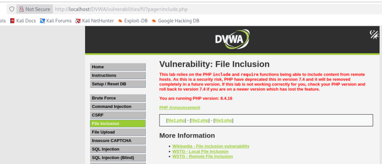
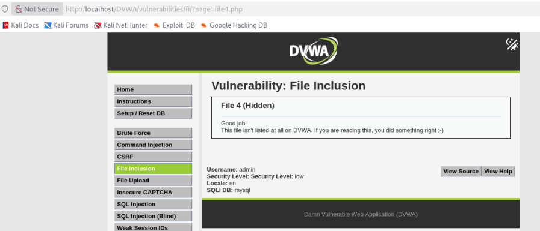
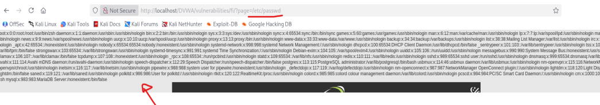

# 03 - File Inclusion

## Clasificación

- OWASP: A05 – Security Misconfiguration  
- Severidad:  Alta  
- CVSS: 8.6 (AV:N/AC:L/PR:N/UI:N/S:C/C:H/I:N/A:N)  
- CWE: CWE-98 – Improper Control of Filename for Include/Require Statement  

---

## Descripción

La aplicación presenta una vulnerabilidad de tipo **File Inclusion**, permitiendo la inclusión de archivos a través de parámetros manipulables sin validación adecuada.

El parámetro utilizado para cargar contenido en la aplicación se introduce directamente en la ruta del archivo que el servidor debe procesar, sin aplicar controles de seguridad.

Esto permite a un atacante modificar la ruta para acceder a archivos no autorizados del sistema.

---

## Evidencia

Durante el análisis se observó que la aplicación permite cargar diferentes archivos mediante un parámetro en la URL.

Inicialmente, la aplicación ofrecía opciones como:

- `file1`  
- `file2`  
- `file3`  

Al modificar manualmente el parámetro a:

```bash
file4
```

## Evidencias visuales

### Interfaz File Inclusion


### Parametro manipulado


### Acceso etc/passwd


## Impacto

La explotación de esta vulnerabilidad permite:

- Acceso a archivos sensibles del sistema
- Exposición de información crítica
- Enumeración de usuarios del sistema
- Posible escalada hacia otras vulnerabilidades

En un entorno real, esta vulnerabilidad puede facilitar ataques más avanzados como Remote File Inclusion (RFI) o ejecución de código.

## Recomendaciones

Para mitigar esta vulnerabilidad se recomienda:

- Validar todos los parámetros de entrada
- Implementar listas blancas (whitelisting) de archivos permitidos
- Evitar el uso directo de rutas proporcionadas por el usuario
- Bloquear secuencias de directory traversal (../)
- Configurar correctamente los permisos de acceso a archivos

## Referencias
- **OWASP Top 10 – A05**: Security Misconfiguration
- **CWE-98** – File Inclusion
- **CAPEC-126** – Path Traversal