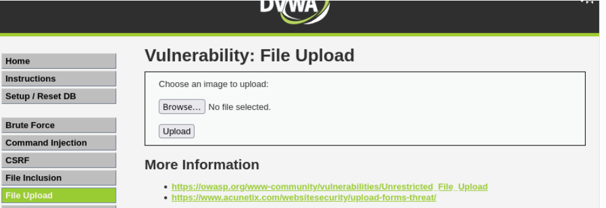
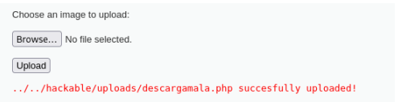
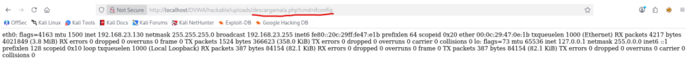

# 04 - File Upload

## Clasificación

- OWASP: A03 – Injection  
- Severidad:  Crítica  
- CVSS: 10 (AV:N/AC:L/PR:N/UI:N/S:C/C:H/I:H/A:H)  
- CWE: CWE-434 – Unrestricted Upload of File with Dangerous Type  

---

## Descripción

La aplicación presenta una vulnerabilidad de tipo **File Upload**, permitiendo la subida de archivos al servidor sin realizar una validación adecuada del tipo o contenido.

Esto permite a un atacante subir archivos maliciosos, como scripts ejecutables, que posteriormente pueden ser utilizados para ejecutar comandos en el servidor.

---

## Evidencia

Durante las pruebas se creó un archivo malicioso con extensión `.php`, diseñado para ejecutar comandos del sistema a través de parámetros en la URL.

El archivo fue subido mediante el formulario de la aplicación sin ningún tipo de restricción.

Tras la subida, el archivo quedó accesible desde el navegador y permitió la ejecución de comandos mediante el parámetro:

```bash
?cmd=
```
### Ejemplo de ejecución

En sistemas Linux:

```
?cmd=ifconfig
```
En sistemas Windows:
```
?cmd=ipconfig
```
La correcta ejecución de estos comandos confirma que el servidor ejecuta código arbitrario subido por el usuario.

## Evidencias visuales

###  Formulario upload


### Archivo subido


### Ejecución comando


## Impacto

La explotación de esta vulnerabilidad permite:

- Ejecución remota de código (RCE)
- Control completo del servidor
- Acceso a archivos del sistema
- Posible persistencia mediante web shells
- Compromiso total de la aplicación

En un entorno real, esta vulnerabilidad es crítica y puede derivar en la toma total del sistema.

## Recomendaciones

Para mitigar esta vulnerabilidad se recomienda:

- Validar estrictamente el tipo de archivo permitido
- Implementar listas blancas de extensiones
- Verificar el contenido real del archivo (no solo la extensión)
- Almacenar archivos fuera del directorio público
- Renombrar archivos subidos
- Bloquear la ejecución de scripts en directorios de subida
## Referencias
- **OWASP Top 10 – A03**: Injection
- **CWE-434** – Unrestricted File Upload
- **CAPEC-650** – Upload a Web Shell