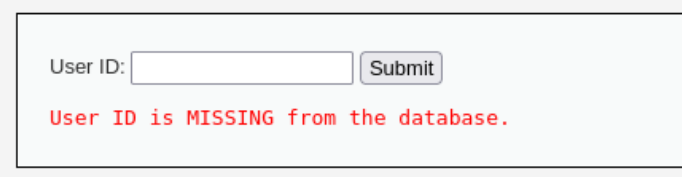
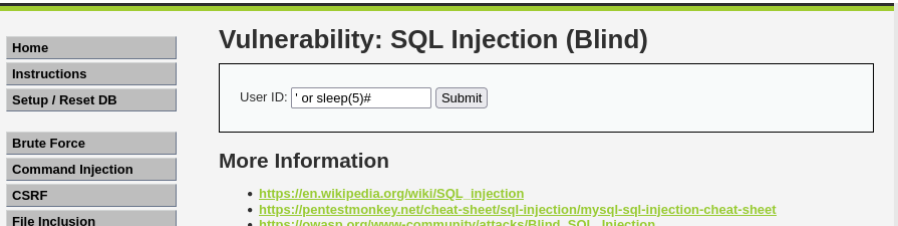
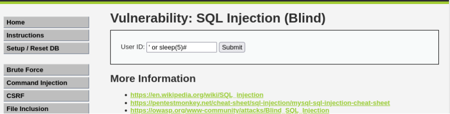

# 05 - SQL Injection (Blind)

## Clasificación

- OWASP: A03 – Injection  
- Severidad:  Crítica  
- CVSS: 10 (AV:N/AC:L/PR:N/UI:N/S:C/C:H/I:H/A:H)  
- CWE: CWE-89 – Improper Neutralization of Special Elements used in an SQL Command  

---

## Descripción

La aplicación presenta una vulnerabilidad de tipo **SQL Injection Blind**, permitiendo la inyección de consultas SQL sin mostrar directamente los resultados en la respuesta.

En este tipo de vulnerabilidad, el atacante no obtiene información explícita en pantalla, pero puede inferirla analizando el comportamiento del sistema.

---

## Evidencia

Durante el análisis se identificó que el parámetro introducido por el usuario se inserta directamente en la consulta SQL sin validación ni sanitización.

Para confirmar la vulnerabilidad, se utilizó una técnica de **Time-Based SQL Injection**, introduciendo el siguiente payload:

```sql
' OR SLEEP(5)#
```
Tras enviar la petición, se observó un retraso aproximado de 5 segundos en la respuesta del servidor, lo que indica que la consulta SQL se ejecutó correctamente.

Posteriormente se realizó una segunda prueba con:

```sql
' OR SLEEP(1)#
```
En este caso, el retraso fue de aproximadamente 1 segundo, confirmando el comportamiento esperado.

Este patrón demuestra que es posible manipular la ejecución de la base de datos mediante inyección SQL.

## Evidencias visuales

### Sql Payload


### Delay 5 segundos


### Delay 1 segundo


## Impacto

La explotación de esta vulnerabilidad permite:

- Extracción de información de la base de datos
- Enumeración de tablas y usuarios
- Acceso a datos sensibles
- Modificación o eliminación de datos

En un entorno real, esta vulnerabilidad puede derivar en el compromiso completo de la base de datos.

## Recomendaciones

Para mitigar esta vulnerabilidad se recomienda:

- Utilizar consultas parametrizadas (Prepared Statements)
- Validar y sanitizar todas las entradas
- Implementar ORM seguros
- Limitar los privilegios de las cuentas de base de datos
Monitorizar consultas sospechosas
## Referencias
- **OWASP Top 10 – A03**: Injection
- **CWE-89** – SQL Injection
- **CAPEC-66** – SQL Injection