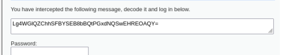
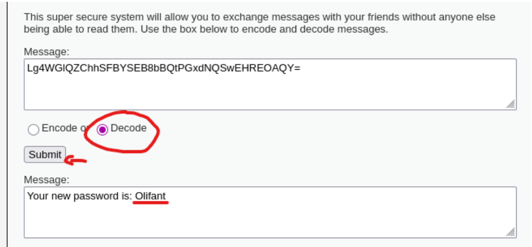
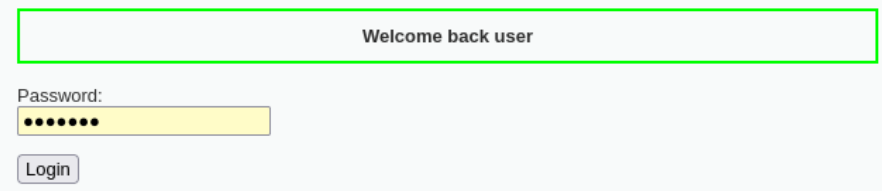

# 06 - Criptografía débil

## Clasificación

- OWASP: A02 – Cryptographic Failures  
- Severidad:  Alta  
- CVSS: 7.5 (AV:N/AC:L/PR:N/UI:N/S:U/C:H/I:N/A:N)  
- CWE: CWE-327 – Use of a Broken or Risky Cryptographic Algorithm  

## Descripción

La aplicación presenta una vulnerabilidad relacionada con el uso de mecanismos criptográficos inseguros.

En lugar de aplicar técnicas de cifrado o hashing robusto, la información sensible se encuentra únicamente **codificada en Base64**, lo que no proporciona ningún nivel real de seguridad.

Base64 es un método de codificación, no de cifrado, por lo que los datos pueden ser fácilmente revertidos.

## Evidencia

Durante el análisis se interceptó un valor que contenía una contraseña codificada.

Tras observar su formato, se identificó que correspondía a una codificación Base64.

El valor fue introducido en una herramienta de decodificación, obteniendo la contraseña original en texto plano.

Posteriormente, se utilizó dicha contraseña para autenticarse correctamente en la aplicación.

Este proceso demuestra que la información sensible puede ser recuperada fácilmente.

## Evidencias visuales

### Interceptamos valor codificado

### Decodificación

### Login exitoso

## Impacto

La explotación de esta vulnerabilidad permite:

- Exposición de credenciales
- Acceso no autorizado a cuentas
- Compromiso de información sensible
- Facilita ataques de diccionario o fuerza bruta

En un entorno real, esto supone un riesgo significativo para la seguridad de los usuarios.

## Recomendaciones

Para mitigar esta vulnerabilidad se recomienda:

- Utilizar algoritmos de hashing seguros (bcrypt, Argon2, PBKDF2)
- Implementar salting en contraseñas
- Evitar el uso de Base64 como mecanismo de protección
- Aplicar políticas de contraseñas robustas
- Limitar intentos de autenticación

## Referencias
- **OWASP Top 10 – A02:** Cryptographic Failures
- **CWE-327** – Weak Cryptography
- **CAPEC-55** – Rainbow Table Password Cracking